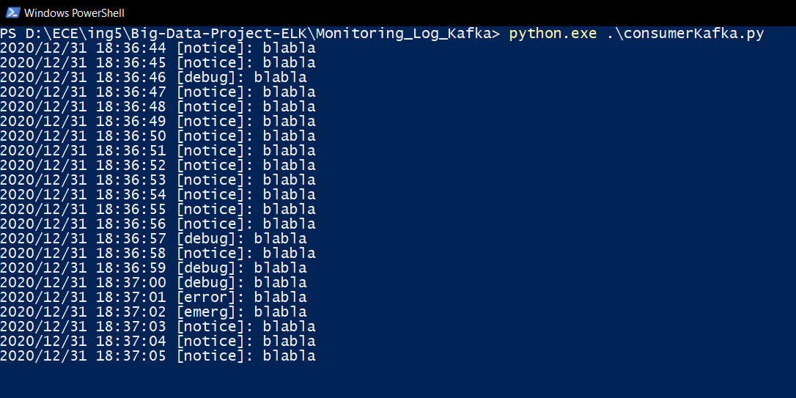

# Big-Data-Project-ELK - Monitoring Log Kafka 
Implementation of the monitoring of logs using Kafka and the ELK suite together. 

# Steps to implement the project 
## Start ELK
1. Start ElasticSearch (in the ElasticSearch folder) : `.\bin\elasticsearch.bat`
2. Start Kibana (in the Kibana folder) : `.\bin\kibana.bat`	

## Start Kafka and the log generator
1. Start zookeeper : `zkserver`
2. Start Kafka (in the kafka folder) : `.\bin\windows\kafka-server-start.bat .\config\server.properties`
3. Create a new topic in kafka : `kafka-topics.bat --create --zookeeper localhost:2181 --replication-factor 1 --partitions 1 --topic logtest`
4. Start the log generator/sender to kafka : `python.exe .\log_generator.py`
5. We can see the logs using the consumer script : `python.exe .\consumerKafka.py`

# Problems encountered
- Connect ELK to Kafka

# Ways to improve
- More complex log generation

# Sources
- [https://towardsdatascience.com/kafka-python-explained-in-10-lines-of-code-800e3e07dad1](https://towardsdatascience.com/kafka-python-explained-in-10-lines-of-code-800e3e07dad1)
- [https://www.elastic.co/fr/blog/just-enough-kafka-for-the-elastic-stack-part1](https://www.elastic.co/fr/blog/just-enough-kafka-for-the-elastic-stack-part1)
- [Zookeeper Website](https://zookeeper.apache.org/releases.html#download)
- [Kafka Website](http://kafka.apache.org/downloads)
