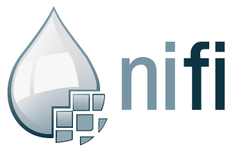

# Big-Data-Project-ELK
This a Project for the ING5 Class of Big Data at ECE Paris, 

Members of the group : 
- Alexis DIREZ
- Neil SEGARD
- Olivia DALMASSO  

The project has to focus on Open Source distributed systems. For doing that we choose ElasticSearch (a platform distributed systems).   

# Progress of the project
We test several uses cases and technologies with Elasticsearch.   
The goal was to implement Elasticsearch with two others Open Source distributed systems: Nifi (Dataflow system) and Kafka.
We present our technical results in the several subfolders of this project. But the architecture/design is presented here in this readme.

# All technologies involved in our project and their use cases

## Elasticsearch

Elasticsearch is a distributed, open source search and analytics engine for all types of data. It provides a distributed, multitenant-capable full-text search engine, it uses JSON documents to store Data. It allows some powerful queries with a system of scoring and a lot of possibilities of aggregation. It is developed in Java. It is often used with the ELK suite (Elasticsearch - Logstash - Kibana), allowed this distributed open source engine to complete ELT (extract-load-transform) actions, aggregations and storage of documents and at the end monitoring and data visualization: a complete and flexible tool! 

## Kibana

Kibana is the Datavisualisation tool of the ELK suite. It allows us to create some visualisations and Dashboard (quite useful for monitoring) with data loaded on Elasticsearch. Kibana gives us also the possibility to implement Machine Learning on the Datasets to try to make some previsions. 

## Logstash and beats

Logstash can be assimilated as the ETL of the ELK suite. It collects, transforms and analyses logs. Beats are transfer agents which allow to centralize logs and files. It uses modules that provide models for ingestion and indexation of classic type of data. Beats can be used as ingest pre-process pipelines and can be used like Kafka. Beats can directly communicate with Elasticsearch or pass data into Logstach in order to continue the transformation of the data. 

## Nifi
 

Apache NiFi is a software project used to automate the flow of data between software systems (Dataflow system). It can also be used as an ETL Extract, transform and load data. It was developed by the NSA (National Security Agency)and then it became open-source.   
Nifi uses templates, processors to describe relations between software systems. It offers some specific features which can help to provide security using TLS encryption, the ability to operate within clusters...   
Nifi, as a Dataflow system, can schedule the flow of data between software systems using classic schedule methods : round robin, FIFO (First In First Out), LIFO (Last In First Out), ...

## Docker

Docker is an open source software, since 2013, that gives the possibility to launch applications and software using images and containers. Images are version of applications and softwares. One can find a lot of existing images in the Docker Hub (open library of container images from applications, software and open source projects). When you launch an image, you create a container. Each container uses an operating system and has a part of memory allowed. Docker has specific features which can let containers use volume on the host machine, and others features useful (improving security...). Docker is used to deploy software rapidly and is less ressources consuming than a Virtual Machine (VM). 

## Kafka 

Kafka is an open source distributed streaming platform, used since 2012. It uses messaging agents and it is written in Scala. Kafka can be used as a messaging, streaming, dataflow of data systems in real time. Kafka uses a binary TCP-based protocol that is optimized for efficiency and relies on a "message set" abstraction that naturally groups messages together to reduce the overhead of the network roundtrip. Thanks to this optimization, the project aims and succeeds to provide a unified, real-time, low-latency system for handeling data streams. 

# Use cases

## Ingestion of data in ElasticSearch with Nifi

### Description of the Use Case

Companies use cases: I want to load, extract, transform data with ingestion pipelines and make some dataflow with only one tool and then analyse, make some queries on a search engine platform.  

#### Ingestion of CV's Data

An IT Consulting firm wants to analyse quickly the CV's of the market in the IT field. The problem is that there is a lot of choice in the market in different sources (indeed, monster, linkedIn)... Take a look at each CV will take a lot of time !   
 

Our project will provide a quick way to see keywords on many CV's in one look. 

  

In this project, we will implement a POC to show how we can analyze CV from a directory of a computer, even if the directory has a lot CV's files (Volume Big Data Problem) with Dashboard.   

#### Ingestion of tweets in the field of Big Data

  

An IT Consulting firm wants to make a technological watch in the field of Big Data by analyzing tweets about it.  
In this project, we will implement a POC to show how we can analyze tweets (if Twitter authorize us). 

#### Ingestion of CSV 

   

A Marketing service of Company wants to analyze rapidly profile of their consumers and to store mail address on a search engine.   
In this project, we will implement a POC to show how we can analyze data from a CSV file with a lot of lines (with only basic columns). 

### Technologies involved

For this 3 mini - Big Data - project, we use: 
- Deployment: Docker to deploy the several open source software with a few commands. 
- Distributed search engine platform: Elasticsearch to store data and allow to make some quick queries/quick search. 
- Datavisualisation tool:  Kibana to analyze and visualize the data
- Dataflow and ETL tool: Nifi 

Others technologies considered: Kakfa for the Dataflow system, Kubernetes for deployment like Docker, Power BI for ETL and Datavisualisation. 

1. **Why Nifi and not Kafka ?** 

For the knowledge of the tool. Members of our group have already used Nifi in intership and no one has already Kafka. But we will test it with the other part of our project. 

2. **Why Docker and not Kubernetes ?**

The two are very useful to deploy projects and version of the software. But we didn't need clusters and orchestrations of containers like Kubernetes provide. Docker has furthermore lighter and faster deployment of containers, which is useful for a POC. 

3. **Why Kibana and Nifi and not Power BI ?** 

Even if Power BI can be very useful with CSV files and make quickly some transformations of the data and very simple and powerful visualisation, we didn't choose it because : 
- Our project focuses on the open source distributed platform Elasticsearch which uses Kibana as Dataviz tool
- Power BI can be limited with the analyse of tweets or maybe with PDF file (CV)
- The free version is limited

### Architecture of the project 

#### Ingestion of CV's Data

  

#### Ingestion of tweets in the filed of Big Data

  

#### Ingestion of CSV

  

### Implementation of Code (Technical projects)

It will be explained in each subfolder (with steps to implement it and a list of problems encountered): 
- [Ingestion of CV's Data](https://github.com/OliviaD00/Big-Data-Project-ELK/tree/main/Ingestion_Nifi_CV_Data)
- [Ingestion of Tweets in the field of Big Data](https://github.com/OliviaD00/Big-Data-Project-ELK/tree/main/Ingestion_Nifi_Tweet)
- [Ingestion of CSV (People Profile)](https://github.com/OliviaD00/Big-Data-Project-ELK/tree/main/Ingestion_Nifi_CSV_Profile)

## Monitoring of logs with Kafka and Elasticsearch

### Description of the Use Case

  

A company with very sensitive data - use case: A bank wants to monitor potential intrusions of its computer equipment.
They want a dashboard to monitor logs of each computer of the company. A security engineer (like SOC) will have to monitore logs and find a way to analyze the behavior of potential threats.  
In this project, we will realize a POC which will show how we can monitor fictive logs of a computer with Dashboard and open source tools. 

### Technologies involved

For this use case, we use :   

- Log generation: Some script to create logs with Python
- Load of data: Filebeat (beats) to collect logs and forwards them to a Kafka topic
- Dataflow and scheduling tool: Kafka to create dataflow and queues it 
- Transformation and process of data tool : Logstash to aggregates date from the Kafka topic, and send to Elasticsearch
- Distributed open source platform: Elasticsearch to index the data into JSON documents
- Datavisualisation tool: Kibana to analyze and visualise the data

We use Python, the ELK suite because we know quite a bit the technologies (others class).   
We use Kafka as a dataflow system because it is often used to queue data and it is very well documented (more than Nifi, we think).    
The other dataflow considered was Nifi but we have already tested it.

### Architecture of the project 

  

### Implementation of Code 

It will be explained (with steps to implement and a list of problems encountered) in the subfolder [Monitoring_Log_Kafka](https://github.com/OliviaD00/Big-Data-Project-ELK/tree/main/Monitoring_Log_Kafka).

## Sources 

- Documentation for Elasticsearch : https://discuss.elastic.co/
- Documentation for Docker : https://forums.docker.com/ ;  https://docs.docker.com/
- Documentation for Nifi : https://nifi.apache.org/docs.html
- Documentation for Kafka : https://kafka.apache.org/documentation/
- Basic Documentation for logs : https://documentation.online.net/fr/dedicated-server/hardware/log-files
- Some tutoriels designed by the community : 
	1. Parsing of CV into JSON : https://github.com/antonydeepak/ResumeParser.git
	2. Ingestion of tweets with Nifi and ELK : https://vichargrave.github.io/programming/tweet-ingestion-with-nifi-and-elasticsearch/ ; https://medium.com/@jdayllon/simple-twitter-monitor-with-elasticsearch-opendistro-15cb52ef420a ; https://yourdataninjas.com/streaming-analytics-demos/
	3. Ingestion of CSV with Nifi and ELK : https://ericlondon.com/2018/03/04/using-nifi-to-convert-csv-to-json-and-store-in-elasticsearch.html ; 
	4. Monitoring Log with Kakfa and ELK : https://www.google.com/amp/s/logz.io/blog/deploying-kafka-with-elk/amp/

